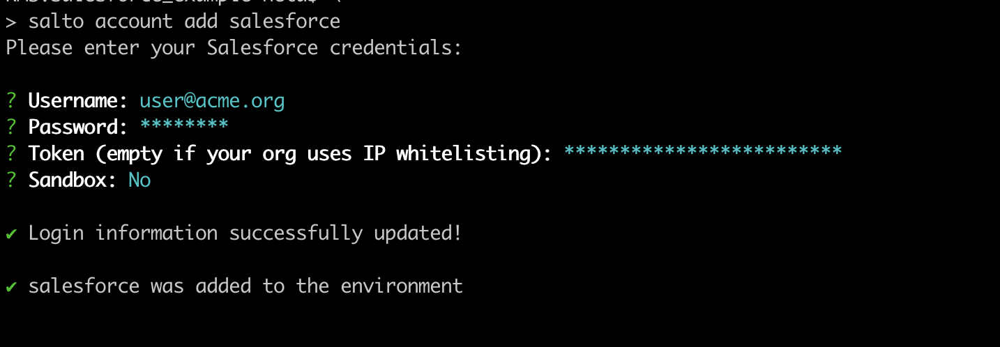
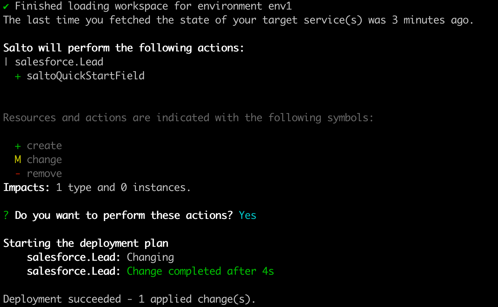
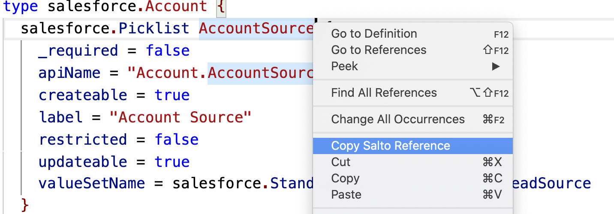

# User Guide

# What's Salto?

Salto allows you to manage your business applications' configuration in code. By doing so, it enables modern devops style methodologies for development, testing and deployment for these business applications.

Salto consists of 3 main components:

1. The NaCl language — a declarative configuration language (follows the syntax of [hcl](https://github.com/hashicorp/hcl/tree/hcl2)), specifically designed to describe the configuration of modern business applications.
2. The Salto command line interface — a tool which uses NaCl files to manage the configuration of business applications, with operations such as `deploy` (to deploy configuration changes to a business application) and `fetch` (to fetch the latest state of a business application into NaCl files). This tool is composed of a core processing engine, and various adapters to interact with the different business applications.
3. The Salto vs-code extension — An extension to the popular vs-code IDE to easily interact with NaCl files.

Currently, Salto supports the following business applications:

- [Salesforce](https://github.com/salto-io/salto/tree/main/packages/salesforce-adapter)
- [NetSuite](https://github.com/salto-io/salto/tree/main/packages/netsuite-adapter)
- [Workato](https://github.com/salto-io/salto/tree/main/packages/workato-adapter)
- [SAP](https://github.com/salto-io/salto/tree/main/packages/sap-adapter)
- [Zuora Billing](https://github.com/salto-io/salto/tree/main/packages/zuora-billing-adapter)
- [Jira](https://github.com/salto-io/salto/tree/main/packages/jira-adapter)
- [Stripe](https://github.com/salto-io/salto/tree/main/packages/stripe-adapter)
- [Okta](https://github.com/salto-io/salto/tree/main/packages/okta-adapter)

Support for other business applications is in the works.

>Throughout this guide, we will use the terms "business applications" and "services" interchangeably

---

# **Getting started**

## Salto CLI Installation instructions

### Install Binary

The easiest way to install Salto's command line interface (CLI) is by downloading its latest binary from the GitHub [Releases page](https://github.com/salto-io/salto/releases/latest) per your operating system type (MacOS / Linux / Windows).

Once you've downloaded the binary, it is advised to copy it somewhere safe and add it to your path.

For example, on Mac (using zsh) one could do:

```shell
mkdir ~/salto
cd ~/salto
curl -Ls https://github.com/salto-io/salto/releases/latest/download/salto-macos.tar.gz | tar -xzf -
echo "export PATH=$PATH:~/salto" >> ~/.zshrc
chmod +x ~/salto/salto
cd -
```

>Note that on new MacOS versions, you will get prompted when trying to run `salto` for the first time, as currently the executable is not signed. As a workaround, you could open Finder, Right-Click the downloaded file, choose `Open` and click `Open` again. This downloaded file will be saved as an exception to your security settings.

Alternatively, you can also just download and copy the binary using other standard tools, and manually edit the PATH per your OS's instructions.

### Upgrade Instructions

The easiest way to upgrade Salto's CLI is to download a new version and replace the old version in place. Do note that currently the Salto CLI does not guarantee backward compatibility of any sort.

### Build From Source

Please refer to [https://github.com/salto-io/salto](https://github.com/salto-io/salto) for build from source instructions (routinely tested on MacOS and Linux, should also work on Windows).

## Quick Start

We will walk you through `initiating` a new Salto `workspace`, adding a service to it, `fetching` the current configuration from the service, making a change to it and `deploying` the change back to the service.

This quick start guide assumes you have credentials for a `Salesforce` dev account (for the sake of the example). If not, either do the relevant adaptations for the business application you would like to interact with, or open a Salesforce developer account at [https://developer.salesforce.com/signup](https://developer.salesforce.com/signup).

### Create a new Salto workspace

First, we'll create a new Salto workspace to store all the Salto NaCl files which represent the configuration of the service we'll start managing using Salto.

In your home directory, please run:

```shell
mkdir quickstart
cd quickstart
salto init
```

This will create a new directory named `quickstart` in your home directory which will serve as the `workspace` for this project. Inside this directory, a `salto.config` directory was created, with some Salto configuration files — no need to worry about these for now. Also, you probably noticed that `salto init` prompted for a name for the "first environment", you can just accept the default for now.

### Add a new application account to the workspace

Next, we'll connect this workspace to a Salesforce account, by running:
```shell
salto account add salesforce
```

This command will prompt you to enter the credentials for your account, please do so.



### Fetch the configuration from your business application to the workspace

Now, we will fetch the current configuration of the connected Salto account into this workspace by running:

```shell
salto fetch
```

This might take a minute or two, after it your workspace will contain a bunch of .nacl files which correspond to your account's configuration!

Now, if you'll make any changes in your Salesforce account (e.g. try to add a custom object or a custom field to an existing object definition) and run `fetch` again, you will see that only those changes are detected and get merged back into the NaCl files.

### Deploy changes to the service

Next, we're going to do some changes in the configuration files and deploy them to service. Specifically, we're going to add a custom field to Salesforce's lead object.

Use your favorite editor to open `salesforce/Objects/Lead/LeadCustomFields.nacl` and insert the following lines at the end of the file in such a way that the last closing bracket '}' is just below them:

```hcl
salesforce.Text saltoQuickStartField {
     length = 32
}
```

This `element` describes your intent to add a new text field named "saltoQuickStartField" with a length of 32 characters to Lead.

Next, run:
```shell
salto deploy
```

Salto will analyze the actions required to perform in order to deploy your changes, and will prompt you to approve these operations. Review the changes, and approve them:



Now, log in into Salesforce's UI, and validate that the relevant field was added.

You can also run `salto fetch` again, to fetch some changes which were auto-generated by Salesforce when this field was added.

## Using Salto with Git

Typically, a Salto workspace maps to a Git repository. Once you have an initial Salto workspace, you would usually run `git init` to create a new git repository. Then you would run `git add .` to add all the currently fetched files (note that your Salto state-files will be saved in the repo!) and `git commit` to record the baseline of your workspace to the repository.

From now on, you can use standard Git commands to record changes, create feature-branches for development work, revert to old versions, compare versions, etc. If you use a platform like GitHub, you can also utilize features like pull requests to perform code reviews and enforce checks on your repository (see [here](https://docs.github.com/en/github/administering-a-repository/about-protected-branches)).

## Advanced Concepts

### Salto Configuration Elements

In its core, Salto fetches the configuration of business system accounts and builds an hierarchy of configuration elements where each element is represented by a unique `Salto Element ID`.

A `Salto Element ID` conforms with the following schema:

```
    <adapter>.<type>.attr.<name>[.<key>...]
    <adapter>.<type>.field.<name>[.<key>...]
    <adapter>.<type>.instance.<name>[.<key>...]
```
A few configuration element id examples:

```bash
# salesforce object
salesforce.MyCustomObj__c

# salesforce object's field
salesforce.MyCustomObj__c.field.MyField__c

# apex class
salesforce.ApexClass.instance.MyApexClass
```

When using Salto's vs-code extension, a `Salto Element ID` can be obtained via right click on the element from the editor and choosing 'Copy Salto Reference'.



The Salto CLI supports various commands for moving, copying, comparing and manipulating configuration elements. These type of commands usually accept a `element-id-selectors` input parameter that enables the user to provide a list of salto element id patterns represented by regular expressions.

For example, all custom fields of the salesforce Lead object can by represented by:

```bash
salesforce.Lead.field.*__c
```

#### NaCl-Case
As seen above, some parts of the element ID can be customized by each adapter. In order to keep the ID structure unambiguous, each part of the element ID is only allowed to contain alphanumeric characters, `_` and `@`.

We transform strings into a specific form satisfying these requirements, which we call `NaCl-case`. At a high level, it is a deterministic transformation that converts all unsupported characters into `_`, and adds a section at the end (starting with `@`) that encodes the characters that were transformed, in order to keep the resulting string unique.

For example:
* `My custom form` becomes `My_custom_form@s`
* `My custom-form` becomes `My_custom_form@sb`
* `My_custom_form` remains `My_custom_form`


### References

In some cases, it is useful to reference one element from another. Such references can be introduced by the adapter, or by the user when manually editing NaCl files.

A reference is done to a `Salto Element ID`.

For example, if we want to define that the value of a certain field will reference the value of another field, we could write :

```hcl
valueSet = salesforce.StandardValueSet.instance.LeadSource.standardValue
```

>In the case you need to reference a specific element in a list, you should use the index as an additional key, e.g. `salesforce.Lead.field.MyField__c.valueSet.2.fullName` would access the fullName attribute of the 3rd element in the list valueSet under the custom field MyField__c which is part of salesforce.Lead

>A reference implies a creation dependency between a source and a target element. Meaning that when element A references element B it also implies that Salto will make sure to create element B before element A is created.

### Variables

Variables let you define a primitive value, give it a name, and then use it multiple times. Variables are defined using a `vars` block:

```hcl
vars {
    secondsPerDay = 86400
    daysPerYear = 365
    firstMonth = "January"
}
```

Variables can be defined anywhere in the NaCl files, and there can be many `vars` blocks. The scope of a variable is always global, so any variable can be referenced from any NaCl file.

A variable is referenced using the following schema: `var.<name>`. For example, we can set:

```hcl
salesforce.CompanySettings {
    fiscalYear = {
        fiscalYearNameBasedOn = "endingMonth"
        startMonth = var.firstMonth
    }
}
```

### Static Files

Static files allows you to store content in an external file referenced in the NaCl file.

This simplifies viewing and editing the content in separate files instead of a huge string block inside a NaCl file.

```hcl
salesforce.Text ApexFileForProfile {
    content = file("salesforce/classes/ApexFileForProfile.cls")
}
```

Those files are stored in the `static-resources` folder inside your workspace (see more at [Workspace Directory Structure](#workspace-directory-structure)).

E.g. for the ApexFileForProfile class above, the content will be saved to `static-resources/salesforce/classes/ApexFileForProfile.cls`.

The files are validated and hashed (MD5) for comparison to see if there are any changes.

This allows you to rename the files as long as the path mentioned in the NaCl file is relative to the `static-resources` folder.

For example you can create the folder `static-resources/ProfileClasses` and move the `ApexFileForProfile.cls` there, and update the NaCl file to point to `ProfileClasses/ApexFileForProfile.cls`.

If the `file` function points to a non existing file, the deploy operation will warn and stop.

**NOTE:** If you remove the Static File usage (remove the `file(...)`), the referenced static file is not deleted.

### Multiple Environments

In a typical feature development process, multiple environments are being used. E.g. a feature is developed in a development environment, gets tested in a testing environment and once approved deployed to a production environment.

In Salto, `environments` are first-level citizens, which also enable the encapsulation of commonalities and differences between application accounts. Before showing some examples for working with environments, we should first explain some common terms and operations:

- An `environment` is a collection of `application accounts`.
- A Salto user is able to determine which of the configuration elements are `common` and which are `environment-specific` by executing the `salto element move-to-common` and `salto element move-to-envs` commands
- A `fetch` operation can work in `align mode`, when it will not modify common configuration, or in standard mode when it will modify both common and environment-specific configuration. As a rule of thumb, `align mode` should be used when the intent is to make sure that the fetched env is aligned with the common configuration elements. When fetching in `align mode`, any modifications to the common elements will be dropped and it should be followed by a deploy operation. Standard fetch mode is used when developing features (as the assumption is that the intent of the user is to eventually deploy the fetched changes to the other environments).

Now, let's follow a common scenario of adding two environments to Salto:
```shell
salto init
```

Note that you've been prompted to give a name for the first environment in the workspace. You can just accept the "env1" value, or choose the name of your liking (we'll use `prod` for this example)

Next, we'll continue similarly to quick-start by adding a application account and running fetch:

```shell
salto account add salesforce
# provide credentials to your "prod" instance
salto fetch
```

Next we will add another environment (`dev`) by running:
```shell
salto env create dev
```

Note that creating this env, also changed the current env to be `dev` (see `salto env current`, `salto env set`, `salto env list`). You should always make sure to run commands in the context of the right env (see also the —-env flag per command)

Now we'll configure this environment to connect to a `dev` instance (e.g. a Salesforce sandbox synched with `prod`) and run fetch:

```shell
salto account add salesforce
# provide credentials to your "dev" instance
salto fetch
```

Lets stop and take a look at our workspace directory structure (for more info see [here](#workspace-directory-structure)):
```shell
— salto.config/
- envs/                  # folder for env specific configuration
    — dev/               # folder for the dev environment specific configuration
	    — salesforce/      # specific config for Salesforce in the dev env
	    — static-resources/ # specific unique static resources for the dev env
    — prod/              # folder for the prod environment specific configuration
	    — salesforce/      # specific config for Salesforce in the prod env
        — static-resources/ # specific unique static resources for the dev env
— salesforce/            # common cross-all-envs configuration for Salesforce
— static-resources       # common static files for all environments

```
Now, in a normal feature development flow we would do some changes to the dev env (e.g. by changing it directly in the service and running `fetch` (normal mode)), or by changing the **common** configuration and deploying to dev. Do not forget to use the `salto element move-to-common <element-selector..>` command in order to configure which elements should be common across all environmetns in the workspace (the `move-to-common` command can be executed at anytime, before or after changing the dev env).  After all tests in dev are done, we can go ahead and run:
```shell
salto env set prod
salto deploy
```

Good luck! You've just pushed your first feature from dev to prod using Salto!

---
More information about the various Salto CLI commands can be viewed [here](/packages/cli/user_guide.md)

---

## Workspace directory structure

The workspace is structured as follows:

- `salto.config` — all workspace specific internal Salto files, including configuration and state files. See [Salto Configuration](salto_configuration.md) for more details.
- Directory per adapter, named after the adapter (e.g. Salesforce, NetSuite) — NaCl definitions which are **common** across all defined environments which are configured per that adapter.
- Directory for [Static Files](#static-files) (`static-resources`).
- envs -- inside envs, there is a directory per environment, named after the environment — NaCl definitions which are **specific** per environment.
  Each environment directory is also divided by adapter (which applies for that environment), furthermore, includes a `static-resources` folder with files **specific** for that environment.

For example, a workspace with 3 environments (named dev, test and prod), each configured with both Salesforce and HubSpot would look like:
```shell
— salto.config/
- envs
    — dev/
        — salesforce/
        — hubspot/
        — static-resources/
    — test/
        — salesforce/
        — hubspot/
    — prod/
        — salesforce/
        — hubspot/
— salesforce/
— hubspot/
— static-resources/
```

## Salto's configuration

Please see [Salto configuration](salto_configuration.md)

## NaCl syntax and feature reference

See the [NaCl syntax documentation](syntax.md)

---

# Salto's Visual Studio Code extension

Please see [https://github.com/salto-io/salto/tree/master/packages/vscode](https://github.com/salto-io/salto/tree/master/packages/vscode) for instructions and details on the Salto VS-Code extension.
