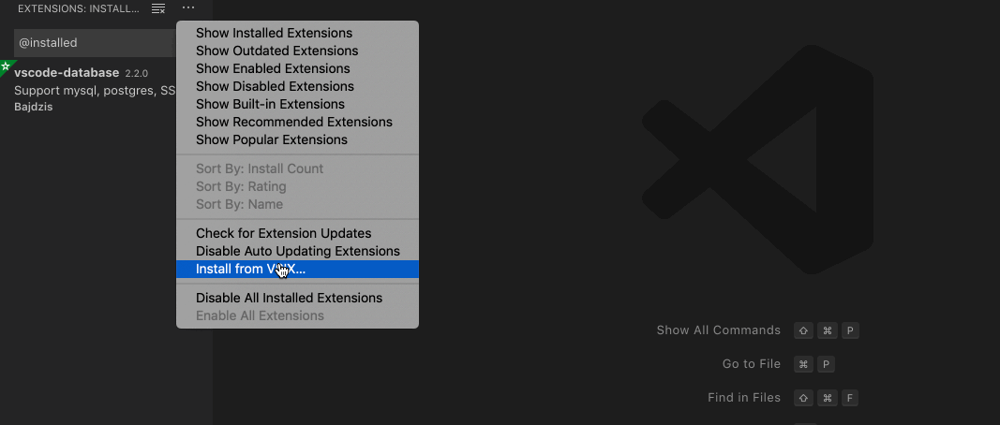
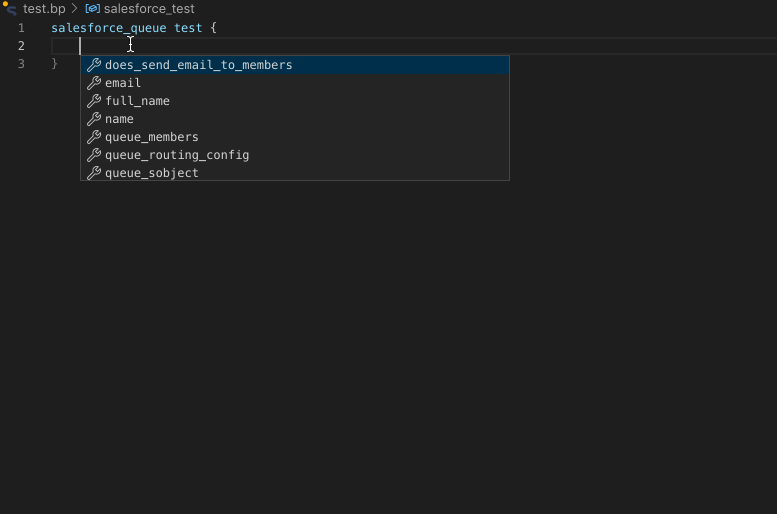
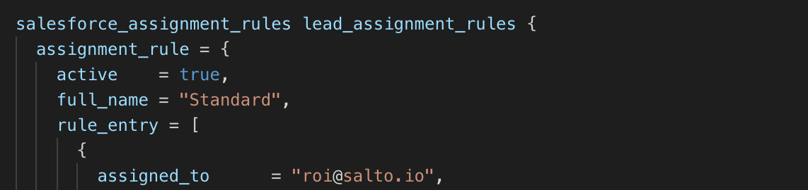
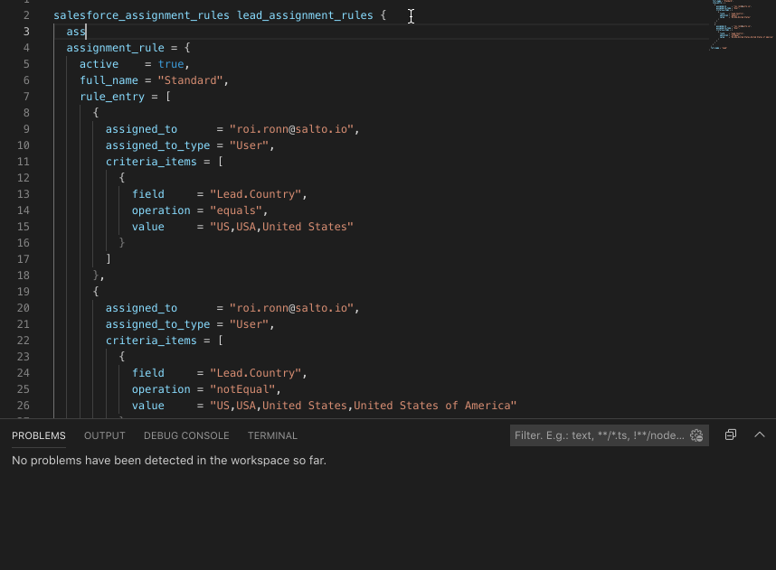
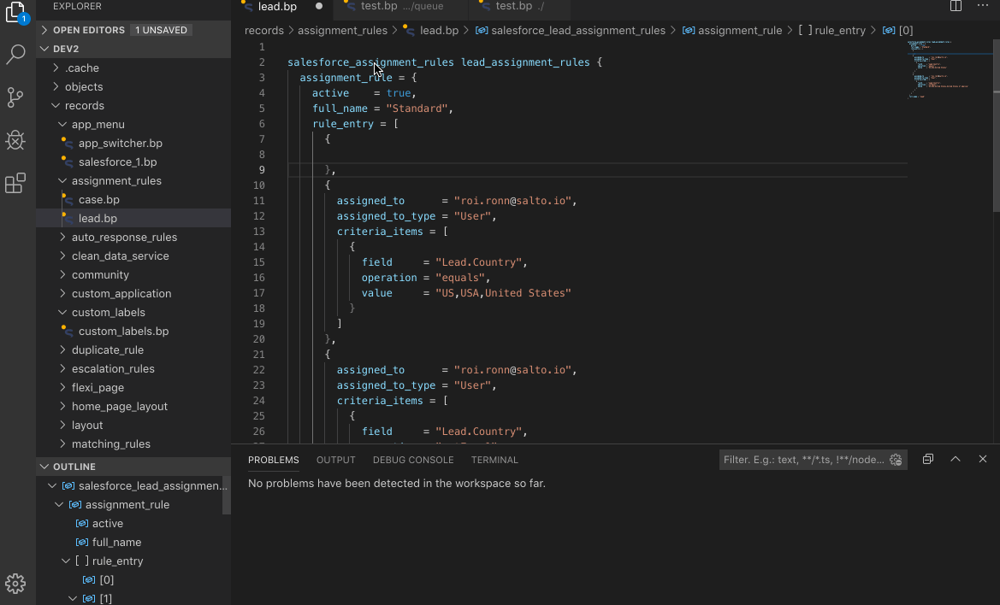

<!-- markdownlint-disable -->
<h1 align="center">
  vscode-salto
</h1>

---

<h4 align="center"Configure, plan and apply .<a href="https://www.salto.io/">Salto</a> patches in vscode.</h4>

---

 &nbsp; &nbsp; 

## Features at a glance

- Auto-completion support.
- Syntax highlighting for `.bp` files.
- Sytax, Merge, and validation error highlighting. 
- Adds a commands for running `salto plan` and `salto apply`
- Browse document symbols
- Browse workspace symbols
- Peek definition
- Goto definition
- Find references
- Show types definition values on hover

## Instalation
Salto is still not registered in the marketplace. To install:
- Download the latest vsix file.
- Open the extension menu.
- Select install from .vsix
- Choose the downloaded file
- Note: On version updates it you might need to manualy delete the extension directory in `$home/.vscode/extensions`

## Auto-completion support

## Syntax Highlighting

## Plan and Apply command execution

You can invoke the command via:
- The commands menu (Press `Cntl+Shift+P` or `⇧⌘P` to open the menu).
- The status bar
- Mac's touch pad

## Error highlighting

### Indexing support
- Press `Ctrl+Shift+O` or `⇧⌘O` to browse symbols in the current file.
- Press `Ctrl+T` or `⌘T` to jump to symbol.
- Press `Alt+F12` or `⌥F12` to peek definition.
- Show type definition on hover
- Outline view support

